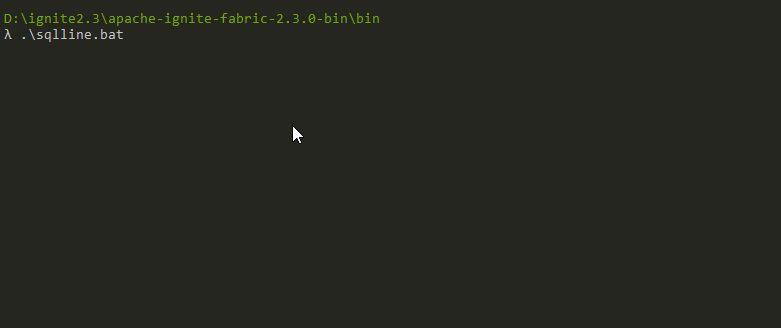
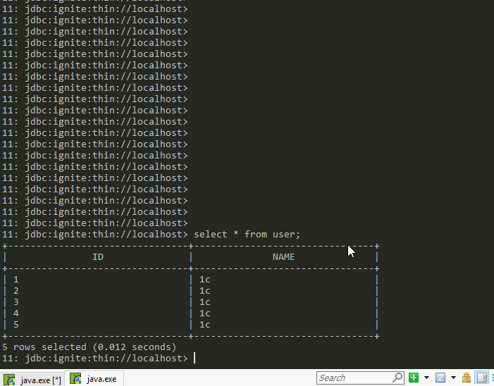

# Ignite
# 一、介绍
`Apache Ignite`是一种存储构架，他实现了非常多的功能。比如他有这样几个标签：内存数据库、键值对数据库、分布式数据库、完整的SQL支持等。可以说Ignite关注了关系型数据库和非关系型数据库数据库的优缺点，将其进行了融合。功能虽然很多，但是在使用的过程中，我们只需要关注怎么使用能满足我们的需求就可以了。Ignite的文档内容非常丰富，而且有[中文版](https://www.zybuluo.com/liyuj/note/230739)，如果想要深入研究Ignite的话，官方文档是最好的途径了。下面的内容我将官方文档内容和例子进行简化，可以带你粗略了解Ignite，我使用的是java版本。
# 二、启动
这里没有安装，下载压缩包后，只要有jdk就能就地启动，甚至不用改配置文件，可以说是零部署。如果想要本地启动集群则多次启动即可，这里启动的默认配置文件在`config/default-config.xml`里，就是一个Bean然后没有配置参数（即默认参数）。  

因为默认参数就在本机找集群的其他节点，所以直接多次启动就能启动集群，实际情况下可能是多台机器、多个ip的集群，此时需要修改配置文件，在Bean中添加如下属性
```xml
<!-- Explicitly configure TCP discovery SPI to provide list of initial nodes. -->
<property name="discoverySpi">
    <bean class="org.apache.ignite.spi.discovery.tcp.TcpDiscoverySpi">
        <property name="ipFinder">
            <!--
                Ignite provides several options for automatic discovery that can be used
                instead os static IP based discovery. For information on all options refer
                to our documentation: http://apacheignite.readme.io/docs/cluster-config
            -->
            <!-- Uncomment static IP finder to enable static-based discovery of initial nodes. -->
            <!--<bean class="org.apache.ignite.spi.discovery.tcp.ipfinder.vm.TcpDiscoveryVmIpFinder">-->
            <bean class="org.apache.ignite.spi.discovery.tcp.ipfinder.multicast.TcpDiscoveryMulticastIpFinder">
                <property name="addresses">
                    <list>
                        <!-- In distributed environment, replace with actual host IP address. -->
                        <value>127.0.0.1:47500..47509</value>
                        <value>192.168.1.4:47500..47509</value>
                    </list>
                </property>
            </bean>
        </property>
    </bean>
</property>
```
上面的方式是最常用的基于组播的集群，会向固定的一组ip进行组播。组播的方式具有传染性，即A机器中写了向B组播，B写了向C组播，则三者全都加入集群。另一种常用的集群组织方式是ZooKeeper
```xml
<property name="discoverySpi">
    <bean class="org.apache.ignite.spi.discovery.tcp.TcpDiscoverySpi">
            <property name="ipFinder">
            <bean class="org.apache.ignite.spi.discovery.tcp.ipfinder.zk.TcpDiscoveryZookeeperIpFinder">
                <property name="zkConnectionString" value="127.0.0.1:2181"/>
            </bean>
        </property>
    </bean>
</property>
```
不管用什么方式我们可以快速的启动ignite服务并能构建集群。
# 三、SQL
因为Ignite功能太多，我们从基本的功能挨个来看。首先Ignite支持完整的sql，也就是说他有MySQL的几乎全部功能。
## 通过`sqlline`连接
在刚才的bin目录下有个sqlline.bat/sqlline.sh可以直接连接Ignite数据库服务
```
./sqlline.bat
> !connect jdbc:ignite:thin://localhost
> !tables
> create table user(id int,name varchar(50),PRIMARY KEY (id));
> insert into  user(id,name) values (1,"liming");
> select * from user;
> update user set name='lili' where id=1;
```

注意ignite支持几乎全部的sql语法，但不支持自增设置。可以[参考支持的sql文档](https://www.zybuluo.com/liyuj/note/990557)。
## 通过`JDBC`连接
客户端程序，需要引入`ignite-core-{version}.jar`或者maven方式，version当前最新的是2.3.0
```xml
<dependency>
    <groupId>org.apache.ignite</groupId>
    <artifactId>ignite-core</artifactId>
    <version>${ignite.version}</version>
</dependency>
```
基本的的用法如下
```java
public class IgniteSQL {
    public static void main(String[] args) throws Exception {
        // Register JDBC driver.
        Class.forName("org.apache.ignite.IgniteJdbcThinDriver");
        // Open JDBC connection.
        Connection conn = DriverManager.getConnection("jdbc:ignite:thin://127.0.0.1/");
        // Create database tables.
        try (Statement stmt = conn.createStatement()) {
            // Create table based on REPLICATED template.
            stmt.executeUpdate("CREATE TABLE City (id int PRIMARY KEY, name VARCHAR)");

            // Create an index on the City table.
            stmt.executeUpdate("CREATE INDEX idx_city_name ON City (name)");
        }
        // Insert
        try (PreparedStatement stmt =
                     conn.prepareStatement("INSERT INTO City (id, name) VALUES (?, ?)")) {
            stmt.setLong(1, 1L);
            stmt.setString(2, "Beijing");
            stmt.executeUpdate();
        }
        // Select
        try (Statement stmt = conn.createStatement()) {
            try (ResultSet rs =
                         stmt.executeQuery("SELECT * FROM  City ")) {
                while (rs.next())
                    System.out.println(rs.getString(1) + ", " + rs.getString(2));
            }
        }
    }
}
```
ignite使用了H2数据库作为存储结构，在集群中查询的时候有着类似GreenPlum的查询原理
# 四、分布式和内存化
我们在上面部分创建了表，插入了数据。可是数据是存到哪里了呢？Ignite默认会将数据存到内存中，即默认就是一个分布式纯内存数据库。如果节点宕机后，存在上面的数据全部丢失，重新启动，数据还是全部丢失（因为只存到了内存）。这是默认的策略我们后面介绍怎么修改这些策略。    
## 修改缓存模式
Ignite提供[三种缓存模式](https://www.zybuluo.com/liyuj/note/964191#33%E7%BC%93%E5%AD%98%E6%A8%A1%E5%BC%8F)分区、复制和本地（PARTITIONED，REPLICATED，LOCAL）。分区策略是默认策略。  
分区就是每个节点存部分数据，并且保证每个数据块有另一个热备份节点也存储了（类似HDFS）
  
复制就是每个节点都存储所有数据  
  
本地模式就是只在当前节点存储数据的方式(官网没给图，这里就不贴了)。  
同样是通过修改配置文件中bean的属性修改模式:
```xml
<bean class="org.apache.ignite.configuration.IgniteConfiguration">
    ...
    <property name="cacheConfiguration">
        <bean class="org.apache.ignite.configuration.CacheConfiguration">
            <!-- Set a cache name. -->
            <property name="name" value="cacheName"/>
            <!-- Set cache mode. -->
            <property name="cacheMode" value="PARTITIONED"/>
            <!-- Number of backup nodes. -->
            <property name="backups" value="1"/>
        </bean>
    </property>
</bean>
```
上面配置为使用分区策略，并配置了有一个节点作为备份，这样的策略可以使得任意节点挂掉后数据不丢失，但是我测试后发现，数据不丢失只限于对k-v存储，上面说的sql存储的数据全部丢失。而且不丢失不代表可以直接访问，还需要等挂掉的节点启动后数据才能访问。所以这部分到k-v后再仔细讲解。
## 修改磁盘持久化
发现全部节点停掉后，因为存到内存的缘故，导致数据全部丢失，
>Ignite的原生持久化会在磁盘上存储一个数据的超集，以及根据容量在内存中存储一个子集。比如，如果有100个条目，然后内存只能存储20条，那么磁盘上会存储所有的100条，然后为了提高性能在内存中缓存20条。 另外值得一提的是，和纯内存的使用场景一样，当打开持久化时，每个独立的节点只会持久化数据的一个子集，不管是主还是备节点，都是只包括节点所属的分区的数据，总的来说，整个集群包括了完整的数据集。   

要开启Ignite的原生持久化，需要给集群的配置传递一个PersistentStoreConfiguration的实例： 
```xml
<bean class="org.apache.ignite.configuration.IgniteConfiguration">
  <!-- Enabling Apache Ignite native persistence. -->
  <property name="dataStorageConfiguration">
    <bean class="org.apache.ignite.configuration.DataStorageConfiguration">
      <property name="defaultDataRegionConfiguration">
        <bean class="org.apache.ignite.configuration.DataRegionConfiguration">
          <property name="persistenceEnabled" value="true"/>
        </bean>
      </property>
    </bean>
  </property>
  <!-- Additional setting. -->
</bean>
```
注意在集群开启了持久化之后，默认不能进行增删改查操作了。需要手动激活，有多种方式可以激活，比如直接在客户端中激活，用web页面激活，用指令激活等这里我们用指令激活。还是bin目录下
```
./control.bat --activate
```
开启磁盘持久化之后会在work目录下产生数据的文件化存储。
持久化可以防止数据的丢失，例如两个server的集群在表中插入5个数据，关闭一个server后，数据会减少，然后再次开启，数据从磁盘中restore恢复到内存重新变成5条。如下图，该场景下[配置文件](conf/ignite-persist.xml)  

# 5 键值对存储