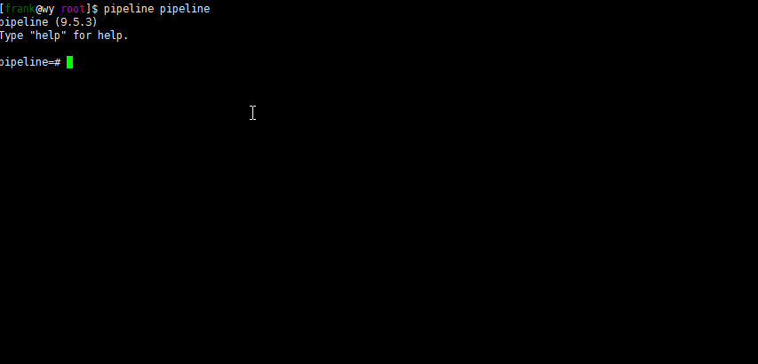
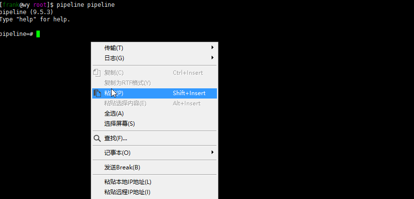

# pipelinedb
# 1 简介
现在的数据分析除了之前讲的`spark` `hadoop`等框架，也出现了另一个分支：数据库直接用sql分析数据。这样的好处是不需要使用者会编程语言，只需要会sql查询即可完成数据分析。`pipelinedb`就是这样的数据库，它基于`postgresql`进行扩展，如果不想用流式数据分析的部分，也可以当做一个普通的`postgresql`来使用。<br><br>
pipelinedb有以下特点：可以控制数据的存活周期，可以进行滑动窗口化分析，可以判断数据触发事件，提供了常用的数学分析函数。<br><br>
[官方文档](http://docs.pipelinedb.com/)写的也非常翔实，建议阅读。
# 2 安装与配置
## 2.1 下载安装
下载页面：[https://www.pipelinedb.com/download](https://www.pipelinedb.com/download)<br>
ubuntu下安装
```shell
dpkg -i pipelinedb-0.9.8u2-ubuntu16-x86_64.deb
```
## 2.2 配置启动
创建一个非root用户
```shell
useradd -g root frank
```
切换到用户：
```shell
su frank
```
初始化数据目录：
```shell
pipeline-init -D <data directory>
```
修改配置：进入刚才指定的目录下修改`pipelinedb.conf`
```
listen_address="*"
log_timezone = 'PRC'
timezone = 'PRC'
shared_preload_libraries = plsh
```
`pg_hba.conf`配置所有ip都是白名单（方便测试）
```
host    all             all             0.0.0.0/0               trust
```
安装plsh扩展：
```shell
git clone https://github.com/petere/plsh.git 
make 
make install
```
后台启动：
```shell
pipeline-ctl -D /home/frank/pipedb/ -l p.log start
```
## 2.3 连接测试
连接：
```
pipeline pipeline (如果是root下进入则要加-u frank)
```
enable plsh扩展：
```
CREATE EXTENSION plsh;
```
这里指令`pipeline pipeline`是指进入默认数据库`pipeline`,如果你创建了其他库
```
CREATE DATABASE dbname;
```
则可以通过`pipeline dbname`进入，数据库远程连接用户名是新创建的用户，这里为`frank`，密码默认是`pipeline`
```
pipeline dbname;
```
# 3 核心概念
## 3.1 stream
stream在pipelinedb中代表一个数据流，他的地位和表/视图是同级的，可以通过create进行创建流，drop删除流，insert将数据插入流：
```
--创建 stream
pipeline=# CREATE STREAM mystream (x integer, y integer);

--插入 stream
pipeline=# INSERT INTO mystream (x, y) VALUES (1, 2);
pipeline=# INSERT INTO mystream (x, y) VALUES (1, 2),(2,2),(3,1);

--删除 stream
pipeline=# DROP STREAM mystream;
```
注意这里并没有查询的select命令，这和stream的特性有关，stream代表的是一个流的入口，数据可以从这个入口进入(insert)，但是stream并不保存任何数据，因而不能在stream上运行任何查询，要想将stream的数据"兜"住，则需要一个持续视图。
## 3.2 continuous view
我们知道视图view是一个抽象的表，即有x,y,z三列的表tb1上可以选出x,y两列组成一个视图，其实就是一张表，只不过区别于table，view并没有单独创建。<br><br>
上面是sql中view的简述，那么continuous view又是指什么呢？pipelinedb中将数据流进行圈定的方式就是持续视图，对照关系如下<br>
```
table--->stream
view--->continuous view
```
区别在于流不能直接用select进行查询，持续视图比起视图有着随着流数据进入会持续更新的效果。概念表述上可能略微复杂，让我们看个例子：
```sql
pipeline=# CREATE STREAM mystream (x integer, y integer);

--myview1保存流中的每一条数据
pipeline=# CREATE CONTINUOUS VIEW myview1 AS SELECT x, y FROM mystream;

--myview2只保存最大的一条x和y的总和
pipeline=# CREATE CONTINUOUS VIEW myview2 AS SELECT max(x), sum(y) FROM mystream;

--插入 stream
pipeline=# INSERT INTO mystream (x, y) VALUES (1, 2),(2,1),(3,3);

--查看 view中数据
pipeline=# SELECT * FROM myview1;
pipeline=# SELECT * FROM myview2;
```
  
从这个例子中不难看出持续视图可以始终记录数据流中最大的x值 以及 y值的和，所以流式数据分析可以通过创建视图的形式就是在实时分析了，要想获得分析的结果只需要通过一个数据库Select语句即可，而又因为pipelinedb本身基于postgresql，所以任何能连接后者的驱动如jdbc/odbc都可以连接改数据库。
## 3.3 sliding windows
上例中我们可能不是想一直存储历史以来的max(x)和sum(y)，而是想存储1小时以内的max(x)和sum(y)，这就需要一个滑动窗口，约束分析的时间范围。
```sql
--对10s内的数据分析
pipeline=# CREATE CONTINUOUS VIEW myview3 WITH (sw = '10 seconds') AS SELECT x,y FROM mystream;
pipeline=# CREATE CONTINUOUS VIEW myview4 WITH (sw = '10 seconds') AS SELECT max(x),sum(y) FROM mystream;
```

## 3.4 continuous transforms
如果想要在数据出现异常值的时候能够触发事件执行`shell`脚本该怎么做呢？pipelinedb提供了持续转换，持续转换和持续视图很像不过他并不存储任何数据，只是提供判断如果数据满足条件则触发事件执行自定义的函数。<br>
例如x的值超过100，则执行一段shell指令(可能是curl调用rest接口去发送邮件，操作空间很大)<br>
### 3.4.1 创建函数
这里用到了我们之前安装的`plsh`扩展
```sql
CREATE or REPLACE FUNCTION myfunc() RETURNS trigger AS
$$
#!/bin/bash
#curl -x http://localhost/sendemail
echo "hi">/home/frank/1.txt
$$
LANGUAGE plsh;
```
### 3.4.2 创建transform：
当x的值大于100的时候触发我们自定义的函数
```sql
CREATE CONTINUOUS TRANSFORM myct AS
    SELECT x FROM mystream WHERE x > 100
    THEN EXECUTE PROCEDURE myfunc();
```
# 4 小结
pipelinedb的性能是非常强的，具体有多强可以自行百度，而且使用方法非常简单。提供的聚合函数很多，不只是sql中就有的sum max等，可以[查看这里](http://docs.pipelinedb.com/aggregates.html)。缺点当然也很明显，首先必须是结构化的数据才能存储，其次sql语言不是万能的，不能进行灵活的分析。
