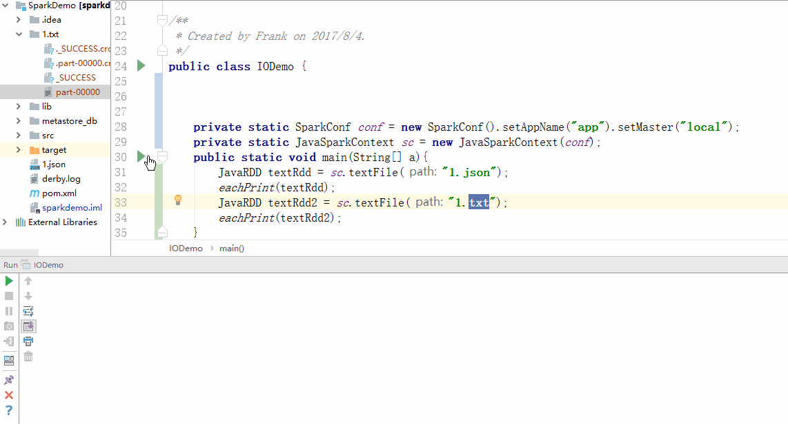
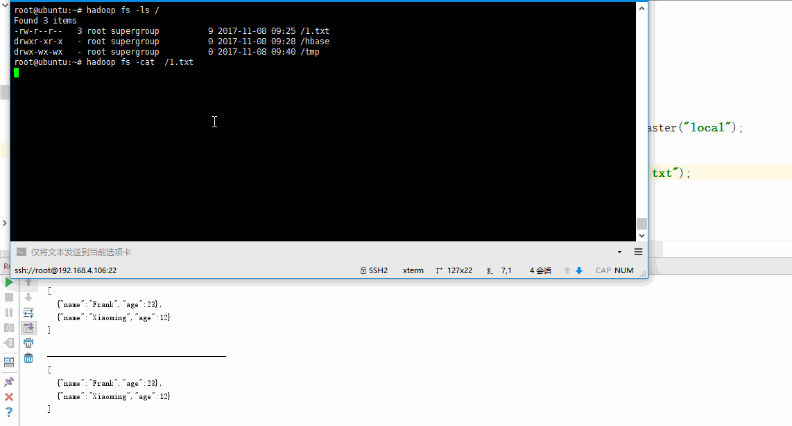
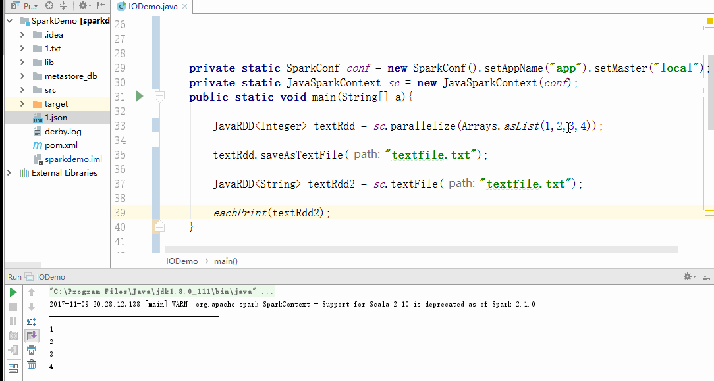
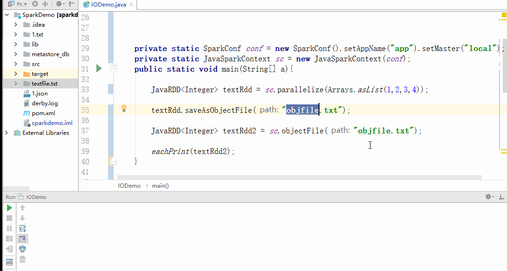
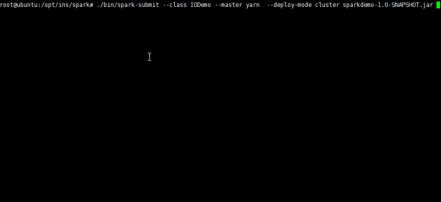

# SparkIO
# 1 简介
在上一节RDD中，我们有两点是走了捷径：  
-- 1 没有搭建Spark服务直接通过maven依赖就可以对RDD进行编程了。     
-- 2 操作的数据是java变量或者本地文件读入的数据。  <br>  
而实际场景下，我们往往会操作HDFS上的文件，而且会以集群的方式运行程序。这一节我们就来看看怎么做到这两点。
# 2 File
最常见的例如`sc.textFile(path)`可以读取文件内容，与之对应的`rdd.saveAsTextFile(path)`则可以将RDD存储到文件(路径已存在则报错)。但是在存储的时候只能存成块状文件，在文件块中可以拼出文件完成信息。

而读取的时候则既可以读取单个文件也可以读取块状文件。


## 2.1  TextFile
纯文本文件的读写。`JavaRDD<String>`是读取的返回值，每一行作为一个元素。
```
rdd.textFile(path)//读取文件

sc.saveAsTextFile(path)//写入文件
```
注意`path`参数不加协议前缀则是本地文件，如果要读写hadoop文件只需要将path改为`hdfs://server:port/path`

## 2.2 ObjectFile
对象文件的读写，如果遇到不是字符串的数据存储，例如`JavaRDD<Integer>`类型，如果按照`saveAsTextFile`写入文件，则是将每个元素运行`toString()`后写入每一行，此时文件还是只能通过如果`textFile`读取，返回值只能是`JavaRDD<String>`而非`JavaRDD<Integer>`。

希望从文件中读取出来还是`JavaRDD<Integer>`类型则要用ObjectFile进行存储。
```
rdd.objectFile(path)//读取文件

sc.saveAsObjectFile(path)//写入文件
```

## 2.3 SequenceFile
序列化文件的读写，前面两种文件我们可以轻松应对RDD的存储了，尤其是ObjectFile可以自动转换，提供了很大的灵活性。可以对于PairRDD的存储该怎么办呢？  

通过SequenceFile来存储：
```
//写入文件，参数依次为path keytype valuetype outputformattype
pairRDD.saveAsHadoopFile("seqfile",IntWritable.class,NullWritable.class,SequenceFileOutputFormat.class);

JavaPairRDD<IntWritable,NullWritable> pairRDD2= sc.sequenceFile("seqfile",IntWritable.class,NullWritable.class);
```
注意这里的类型都是Hadoop的可序列化到文件里的类型不能直接用Integer String这种。
# 3 搭建[2.1.0]
经过前面的学习，对于Spark已经有了初步的了解，Spark本身有着独立集群，提供scala以及python的交互式客户端。在用Java写的时候，可以看出经常需要写接口类例如Function，代码非常冗长，Scala和Python中则精简了很多。使用交互式客户端可以完成上一节我们的所有例子。  <br>
1 官网下载安装包，配置环境变量<br>
2 将之前的Hive的tmp存储目录设为777，我之前是/tmp/hive
```
chmod -R 777 /tmp/hive
```
3 启动`pyspark`
![img/spark6]
## 3.1 Spark独立集群
独立集群有两种角色Master和Worker，即班长和普通员工。我们在一台机子上运行的话，只能将这俩角色强加在一个人身上了。配置以下两个文件：<br>
1 [slaves](conf/slaves)<br>
2 [spark-env.sh](conf/spark-env.sh)<br>
注意默认web端口是8080，我将其改为了[18080](conf/spark-env.sh)<br>
  
修改后即可启动：
```
./sbin/start-all.sh
```
最好是到该目录下运行这个脚本，因为前面Hadoop中也有个start-all.sh。环境变量写的先后影响指向。  

检查是否启动成功：jps指令看到Master和Worker即成功
## 3.2 提交到独立集群运行
1 在windows下编程,修改`setMaster`，可以直接删掉`Sparkconf`中的setMaster部分，通过运行的脚本中指定`--master`参数
```
SparkConf conf = new SparkConf().setAppName("app")
```
2 打jar包
```
mvn package
```
3 到服务器运行spark-submit
```
./bin/spark-submit \
  --class <main-class> \
  --master <master-url> \
  --deploy-mode <deploy-mode> \
  --conf <key>=<value> \
  ... # other options
  <application-jar> \
  [application-arguments]
```
例如：
```
./bin/spark-submit --class IODemo --master spark://192.168.4.106:7077  --deploy-mode cluster sparkdemo-1.0-SNAPSHOT.jar 
```


## 3.3 提交到Yarn集群运行
独立集群对于HDFS的读取没有更大的收益，独立集群在读取文件和写入文件的时候都是通过HDFS的NameNode进行操作，有大量的网络IO产生，所以效率较低。<br>
Hadoop为了让其他计算框架能更好的运行在HDFS上，提供了yarn平台，对于HDFS有着更好的访问速度。<br>
1 先确保搭建了yarn平台<br>
2 提交jar包
```
./bin/spark-submit --class IODemo --master yarn  --deploy-mode cluster sparkdemo-1.0-SNAPSHOT.jar 
```
3 检查运行状态和文件内容



