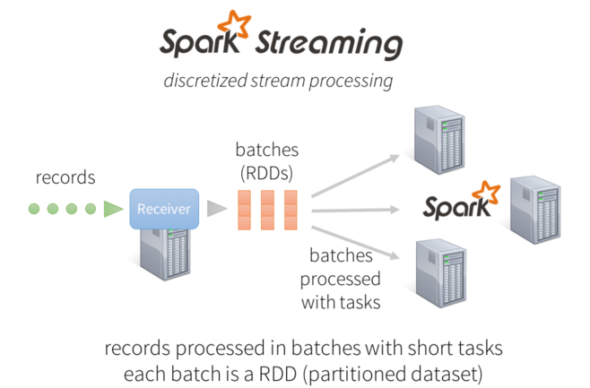
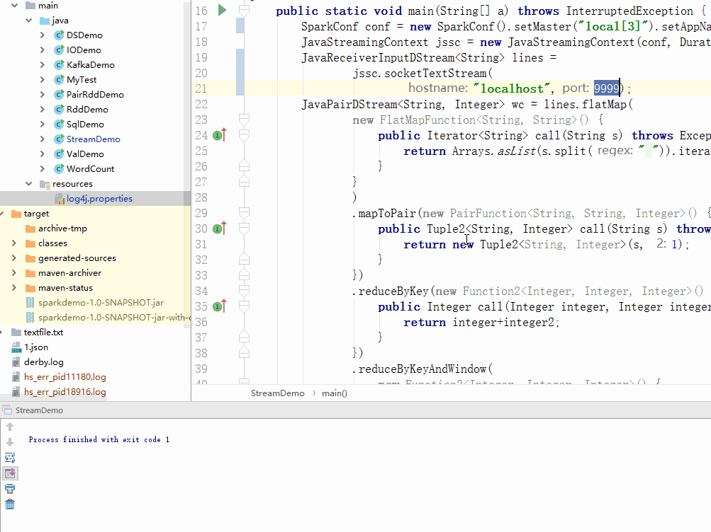

# SparkStream
# 1 简介
之前讲的数据分析方式都是对离线文件的数据进行分析，对于大型的文件库，我们可以通过HDFS进行分布式文件存储，而对于半结构化或者结构化的数据，如Json文件，我们可以运行SparkSQL或者Hive直接用Sql语句进行查询。当然也可以选择在存储的时候使用Hbase这种非关系型数据库，牺牲条件查询的灵活性以求更快的查询速度。对于没有明显结构性或者需要更灵活的分析的情况，我们则需要用Spark编程分析。<br><br>
SparkStream可以进行实时的流式数据分析，为什么需要流式数据分析呢？有些时候我们必须及时作出响应，如果等到数据传完或者一段时间之后再去分析数据就已经来不及了。SparkStream就是这样的可以实时分析数据的框架，另一个也很有名的框架叫Storm，这里没有专门写文章介绍。两者区别是Spark更擅长滑动时间窗口下的数据集分析，例如十分钟内的数据分析。而Storm则注重高并发情况下的实时性，立即响应，例如淘宝双十一成交订单数。<br><br>
SparkStream在执行的时候需要明白集群过程的分布方式，接收数据的点一般设置为一个来收数据，接收之后的数据集处理分到多个worker上面去执行。


# 2 WordCount
```
//这里启动的是SparkStreamContext
//至少设置两个节点，否则因为数据至少在俩节点备份
SparkConf conf = new SparkConf().setMaster("local[2]").setAppName("NetworkWordCount");
JavaStreamingContext jssc = new JavaStreamingContext(conf, Durations.seconds(1));


//直接连接本地9999端口TCP套接字服务，来接收数据[lines是回车隔开的行元素集合]
JavaReceiverInputDStream<String> lines = jssc.socketTextStream("localhost",9999);

//DStream的操作和RDD的类似，我们照抄之前的WordCount步骤
JavaPairDStream<String, Integer> wc = lines.flatMap(
	new FlatMapFunction<String, String>() {
		public Iterator<String> call(String s) throws Exception {
			return Arrays.asList(s.split(" ")).iterator();
		}
    })
    .mapToPair(new PairFunction<String, String, Integer>() {
	    public Tuple2<String, Integer> call(String s) throws Exception {
	        return new Tuple2<String, Integer>(s,1);
        }
    })
	.reduceByKey(new Function2<Integer, Integer, Integer>() {
		public Integer call(Integer integer, Integer integer2) throws Exception {
			return integer+integer2;
        }
    })

	//到这里已经得到结果，但是流式分析中需要应用到窗口中，因为上述统计的W-C是一簇一簇的数据流中的W-C
	//需要按照一定的时间窗口将簇聚合，如下为每10s钟聚合一次(滑动时间)，聚合的是30s内的数据(窗口时间)
    .reduceByKeyAndWindow(
	    new Function2<Integer, Integer, Integer>() {
	        @Override
            public Integer call(Integer integer, Integer integer2) throws Exception {
	            return integer+integer2;
            }
        },
        Durations.seconds(30),
        Durations.seconds(10)
);


wc.print();
jssc.start();              
jssc.awaitTermination();
```
如果将master设为3个有可能有两个负责接收，一个负责处理

# 3 小结
流式数据分析的API，DStream的操作和之前的RDD操作是一样的，我们只需要将其理解为一小簇的RDD，在进行一样的操作，相当于是RDD的微分的操作，要看到实际数据还需要框定积分的上下限进行聚合，即滑动窗口。<br>
在大数据分析中，一般不太会用上面例子中的TCP服务器进行数据采集，往往常用的是接入Kafka作为消费者获取数据，可以参考[例子](https://github.com/sunwu51/SparkDemo/blob/master/src/main/java/KafkaDemo.java)的写法。